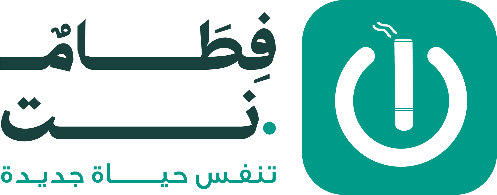

# فطام.نت - صفحة هبوط احترافية | Fitam.net Landing Page

<div align="center">
  
  
  **منصة مهنية للإقلاع عن التدخين - تنفس حياة جديدة**
  
  [](https://reactjs.org/)
  [](https://tailwindcss.com/)
  [](#)
  [](#)
</div>

## 🌟 نظرة عامة | Overview

صفحة هبوط احترافية ومتطورة لمنصة فطام.نت المتخصصة في برامج الإقلاع عن التدخين. تم تصميمها بأحدث التقنيات لتوفير تجربة مستخدم استثنائية مع دعم كامل للغتين العربية والعبرية.

A professional and modern landing page for Fitam.net, a specialized smoking cessation platform. Built with cutting-edge technologies to provide an exceptional user experience with full Arabic and Hebrew language support.

## ✨ الميزات الرئيسية | Key Features

### 🎨 **تصميم متطور**
- **تصميم متجاوب** يعمل بشكل مثالي على جميع الأجهزة
- **رسوم متحركة سلسة** باستخدام Framer Motion
- **تأثيرات بصرية متقدمة** مع Glass Morphism
- **ألوان العلامة التجارية** المتناسقة (#009b88, #d7f9f4, #7c7c7c)

### 🌐 **دعم متعدد اللغات**
- **العربية** مع دعم كامل لـ RTL
- **العبرية** مع دعم كامل لـ RTL
- **خط Fatimah Arabic** الأصلي
- **تبديل سهل** بين اللغات

### 📱 **تجربة مستخدم متميزة**
- **تحميل سريع** مع تحسين الأداء
- **تنقل سلس** بين الأقسام
- **نماذج تفاعلية** لجمع العملاء المحتملين
- **تحسين محركات البحث** (SEO)

### 🎯 **أقسام متخصصة**
- **قسم البطل** مع إحصائيات مذهلة
- **الخدمات** المتخصصة
- **رحلة النجاح** التفاعلية
- **شهادات العملاء** المتحركة
- **معلومات الخبير** المعتمد
- **نموذج التواصل** المتقدم

## 🛠️ التقنيات المستخدمة | Technologies Used

- **React 18** - مكتبة JavaScript الحديثة
- **Tailwind CSS** - إطار عمل CSS المتقدم
- **Framer Motion** - مكتبة الرسوم المتحركة
- **Lucide React** - مجموعة أيقونات متطورة
- **Vite** - أداة البناء السريعة
- **Custom Fonts** - خط Fatimah Arabic الأصلي

## 🚀 التشغيل المحلي | Local Development

### المتطلبات | Prerequisites
```bash
Node.js >= 18.0.0
npm >= 8.0.0
```

### التثبيت | Installation
```bash
# استنساخ المستودع
git clone https://github.com/MohandAdris/fitam-landing-page.git

# الانتقال إلى المجلد
cd fitam-landing-page

# تثبيت التبعيات
npm install

# تشغيل الخادم المحلي
npm run dev
```

### الأوامر المتاحة | Available Scripts
```bash
npm run dev          # تشغيل الخادم المحلي
npm run build        # بناء المشروع للإنتاج
npm run preview      # معاينة البناء المحلي
npm run lint         # فحص الكود
```

## 📁 هيكل المشروع | Project Structure

```
fitam-landing-page/
├── src/
│   ├── assets/                 # الصور والخطوط
│   │   ├── FatimahArabic*.otf # خطوط Fatimah Arabic
│   │   ├── fitam-logo-official.png
│   │   ├── hero-background.png
│   │   ├── expert-portrait.png
│   │   ├── success-journey.png
│   │   └── wellness-icons.png
│   ├── components/            # مكونات React
│   │   └── ui/               # مكونات واجهة المستخدم
│   ├── App.jsx               # المكون الرئيسي
│   ├── App.css              # الأنماط الرئيسية
│   └── main.jsx             # نقطة الدخول
├── public/                   # الملفات العامة
├── dist/                    # ملفات البناء
└── README.md               # هذا الملف
```

## 🎨 التخصيص | Customization

### تغيير الألوان | Changing Colors
```css
/* في App.css */
:root {
  --fitam-primary: #009b88;    /* اللون الأساسي */
  --fitam-secondary: #d7f9f4;  /* اللون الثانوي */
  --fitam-gray: #7c7c7c;       /* اللون الرمادي */
}
```

### تعديل المحتوى | Content Modification
```javascript
// في App.jsx - قسم content
const content = {
  ar: {
    hero: {
      title: 'العنوان الجديد',
      subtitle: 'العنوان الفرعي',
      description: 'الوصف الجديد'
    }
  }
}
```

### إضافة صور جديدة | Adding New Images
1. ضع الصورة في `src/assets/`
2. استوردها في `App.jsx`
3. استخدمها في المكون المناسب

## 📧 نموذج التواصل | Contact Form

النموذج يجمع المعلومات التالية:
- الاسم الأول واسم العائلة
- البريد الإلكتروني
- رقم الهاتف

يمكن ربطه بخدمات مثل:
- **Formspree** للنماذج البسيطة
- **Netlify Forms** للاستضافة على Netlify
- **EmailJS** للإرسال المباشر
- **API مخصص** للتكامل مع قاعدة البيانات

## 🚀 النشر | Deployment

### Netlify
```bash
npm run build
# ارفع مجلد dist إلى Netlify
```

### Vercel
```bash
npm run build
# ارفع المشروع إلى Vercel
```

### GitHub Pages
```bash
npm run build
# استخدم GitHub Actions للنشر التلقائي
```

## 📱 الاستجابة | Responsive Design

الموقع محسن للعمل على:
- **الهواتف الذكية** (320px+)
- **الأجهزة اللوحية** (768px+)
- **أجهزة الكمبيوتر المحمولة** (1024px+)
- **الشاشات الكبيرة** (1440px+)

## 🔧 التطوير | Development

### إضافة ميزات جديدة
1. أنشئ فرع جديد: `git checkout -b feature/new-feature`
2. اكتب الكود الجديد
3. اختبر التغييرات: `npm run dev`
4. ادفع التغييرات: `git push origin feature/new-feature`
5. أنشئ Pull Request

### إرشادات المساهمة
- استخدم أسماء متغيرات واضحة
- اكتب تعليقات بالعربية والإنجليزية
- اتبع معايير Tailwind CSS
- اختبر على جميع الأجهزة

## 📄 الترخيص | License

هذا المشروع مرخص تحت رخصة MIT - انظر ملف [LICENSE](LICENSE) للتفاصيل.

## 🤝 المساهمة | Contributing

نرحب بالمساهمات! يرجى قراءة [دليل المساهمة](CONTRIBUTING.md) قبل البدء.

## 📞 التواصل | Contact

- **الموقع**: [fitam.net](https://fitam.net)
- **البريد الإلكتروني**: info@fitam.net
- **الهاتف**: +972-50-123-4567

## 🙏 شكر وتقدير | Acknowledgments

- **فريق فطام.نت** على الثقة والتعاون
- **مجتمع React** على الأدوات الرائعة
- **مطوري Tailwind CSS** على الإطار المتميز
- **مصممي خط Fatimah Arabic** على الخط الجميل

---

<div align="center">
  <p><strong>صُنع بـ ❤️ لمنصة فطام.نت</strong></p>
  <p><em>تنفس حياة جديدة</em></p>
</div>
